# KatiePoint User Guide

Welcome to **KatiePoint** — a heavily-customised fork of CrossPoint firmware for the **Xteink X4** (and X3) e-paper reader. This guide covers the hardware controls, navigation, and reading features of the device.

> [!NOTE]
> KatiePoint has diverged substantially from upstream CrossPoint. If you have used CrossPoint before, the sections on the **[Home Screen](#3-home-screen)**, **[Getting Books onto the Device](#5-getting-books-onto-the-device)**, **[Sync](#10-sync-bookfusion--koreader)**, **[Reading Stats](#9-reading-stats)**, and the **[Settings Reference](#12-settings-reference)** are the ones most worth reading. For the full technical changelog, see [CHANGES.md](./CHANGES.md).

## Contents

- [1. Hardware Overview](#1-hardware-overview)
- [2. Power & Startup](#2-power--startup)
- [3. Home Screen](#3-home-screen)
- [4. Reading Mode](#4-reading-mode)
- [5. Getting Books onto the Device](#5-getting-books-onto-the-device)
- [6. Browsing Your Library](#6-browsing-your-library)
- [7. The Reader Menu](#7-the-reader-menu)
- [8. Bookmarks & Clippings](#8-bookmarks--clippings)
- [9. Reading Stats](#9-reading-stats)
- [10. Sync (BookFusion & KOReader)](#10-sync-bookfusion--koreader)
- [11. Bluetooth Page Turner](#11-bluetooth-page-turner)
- [12. Settings Reference](#12-settings-reference)
- [13. Sleep Screen](#13-sleep-screen)
- [14. Firmware Updates](#14-firmware-updates)
- [15. Supported Languages](#supported-languages)
- [16. Troubleshooting & Escaping Bootloop](#16-troubleshooting--escaping-bootloop)

---

## 1. Hardware Overview

KatiePoint runs on the **Xteink X4** and **X3**. Physical button positions differ slightly between models, but the *logical* functions are the same.

### Button Layout (X4)

| Location        | Buttons                                              |
| --------------- | ---------------------------------------------------- |
| **Bottom Edge** | **Back**, **Confirm**, **Left**, **Right** (front buttons — remappable) |
| **Right Side**  | **Up** / **Down** (page turn), **Power**, **Reset**  |

On the **X3**, the **Power** button is on the top-right; the **Up**/**Down** buttons sit on the right edge. On the **X4**, Power is on the right edge above Up/Down.

The four **front buttons** (Back / Confirm / Left / Right) can be reassigned to different physical positions in **Settings → System → Remap Front Buttons**. Throughout this guide, button names refer to their *logical* role, not a fixed physical position.

### Taking a Screenshot

- Press **Power + Down** at the same time to save a screenshot to `screenshots/` on the SD card.
- Or, while reading, open the **[Reader Menu](#7-the-reader-menu)** and choose **Take Screenshot**.
- You can also bind **Screenshot** to any reader button (see **[Reader Controls](#reader-tab)**).

---

## 2. Power & Startup

### Power On / Off

- **Turn on/off:** press and hold **Power** for about half a second.
- You can configure a **short** Power press to do something else (page turn, sleep, sync, bookmark) — see **[Short Power Button](#system-tab)**. When a short press is repurposed, turning the device *off* requires a long press.
- **Reboot / recover:** press and release **Reset**, then quickly press and hold **Power** for a few seconds.

### First Launch

On first boot you land on the **[Home Screen](#3-home-screen)**. On later restarts, KatiePoint automatically reopens the last book you were reading.

---

## 3. Home Screen

The Home screen is the main hub. Its layout depends on the **UI Theme** (Settings → Display → UI Theme):

| Theme | Home layout |
|-------|-------------|
| **Classic** | Original KatiePoint look; one recent-book tile plus the menu. |
| **Lyra** | Rounded elements and menu icons; one recent-book tile. |
| **Lyra Extended** | Like Lyra, but shows the **3** most recent books instead of 1. |
| **Lyra Library** | Replaces the recent tile with a paginated **cover grid** of every book on the SD card (the Library view). |

### Recent-book tile

Shows your most recently opened book(s) with cover, title, author, and progress.

- **Confirm** on a tile → open that book.
- **Long-press Confirm** on a tile → open the **Book Options** popup (an inline modal): *Mark as Read, Reset Progress, Shelve, Delete, Reindex, Regenerate Cover*. This does not navigate away from Home.

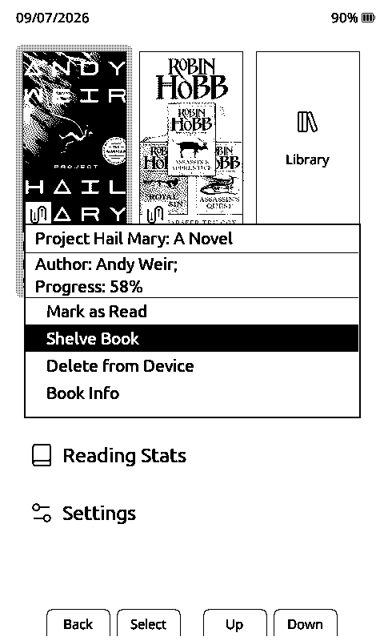

### Library cover grid (Lyra Library theme)

A 3-column paginated grid of every book on the card. Cover thumbnails are cached to the SD card. Selecting a book opens it; long-pressing **Confirm** opens the same Book Options popup as the recent tile.

<p>
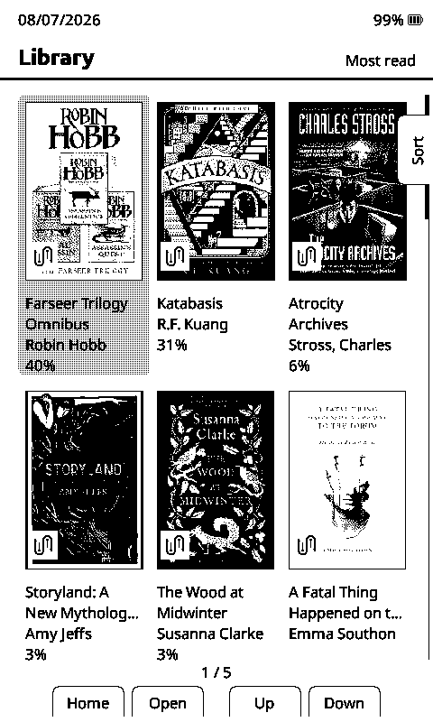
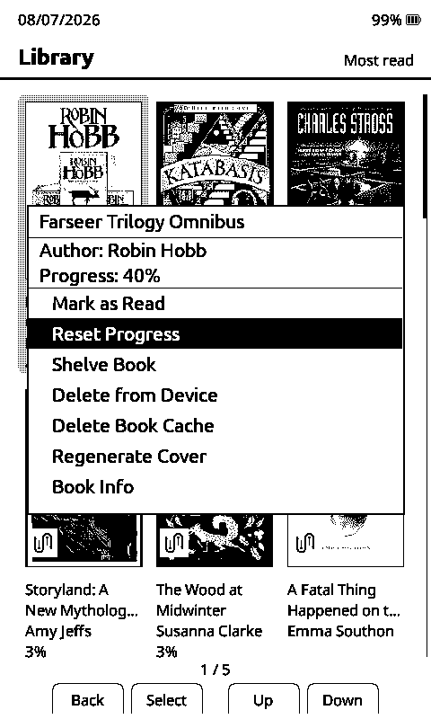
</p>

### Home menu

The menu (shown at the bottom, or as icons in Lyra themes) contains:

- **Browse Files** — the file/folder browser (see **[Browsing Your Library](#6-browsing-your-library)**).
- **OPDS Browser** — *only shown when an OPDS server URL is configured.* Browse and download from an OPDS catalogue.
- **File Transfer** — get books onto the device (see **[Getting Books onto the Device](#5-getting-books-onto-the-device)**).
- **Reading Stats** — your reading statistics (see **[Reading Stats](#9-reading-stats)**).
- **Settings** — device configuration (see **[Settings Reference](#12-settings-reference)**).

**Navigate:** use **Left/Up** and **Right/Down** (or the side **Up/Down** buttons) to move the cursor; **Confirm** to select.

---

## 4. Reading Mode

Once a book is open, the buttons change to reading functions.

### Page Turning

| Action            | Buttons                          |
| ----------------- | -------------------------------- |
| **Previous Page** | **Left** *or* side **Up**        |
| **Next Page**     | **Right** *or* side **Down**     |

If **Short Power Button** is set to **Page Turn**, a short Power press also turns the page.

### Chapter Navigation

- **Next chapter:** press and *hold* **Right** (or side **Down**) briefly, then release.
- **Previous chapter:** press and *hold* **Left** (or side **Up**) briefly, then release.

This behaviour is configurable. By default long-press skips chapters; you can change long-press to *scroll a page* instead, and every reader button's short- and long-press action can be reassigned — see **[Reader Controls](#reader-tab)**.

### System Navigation

- **Return Home:** press **Back**.
- **Return to Browse Files:** press and *hold* **Back**.
- **Reader Menu:** press **Confirm** (see **[The Reader Menu](#7-the-reader-menu)**).

### On-screen button hints

KatiePoint can draw small labels next to each physical button while reading, so you always know what each press does. Enable via **Settings → Reader → Show Button Hints** or the **Button Hints** reader-menu action. Hint modes: **None**, **Short Press**, **Long Press**, **Front Only (Short)**, **Front Only (Long)**. Hints are X3/X4-aware and never overlap page text.


### Auto-Turn

Automatically turns the page on a timer. Set via the reader menu (**Auto Page Turn**): **Off**, **Auto**, or a fixed interval (60s / 50s / 40s / 35s / 30s / 25s / 20s). **Auto** uses your calibrated reading speed and shows the estimate inline, e.g. `Auto (~45s)`; if no speed has been measured yet, Auto behaves as Off.

### Bionic Reading

An optional mode that bolds the leading portion of each word to guide the eye. Toggle it in **Settings → Reader → Bionic Reading**, or bind **Bionic** to a reader button. Changing it re-lays out the text, so cached pages regenerate the first time you open a book afterwards.

Off (left) vs. on (right):

<p>


</p>

---

## 5. Getting Books onto the Device

KatiePoint reads **`.epub`**, **`.txt`**, and **`.xtc`** files. There are several ways to load them.

### SD card (offline)

Insert the SD card into a computer and copy files anywhere on it. KatiePoint scans the whole card. When you add files this way, the file browser sees them immediately; the Library cover grid may need a rescan (**Settings → Developer → Recache Library**, with Developer Mode on).

### File Transfer menu

**Home → File Transfer** offers four wireless options:

1. **Join Network** — connects to your WiFi and hosts a web upload server. Open the shown URL in a browser on the same network to drag-and-drop books (and manage files / fonts / settings). See the [webserver docs](./docs/webserver.md).

   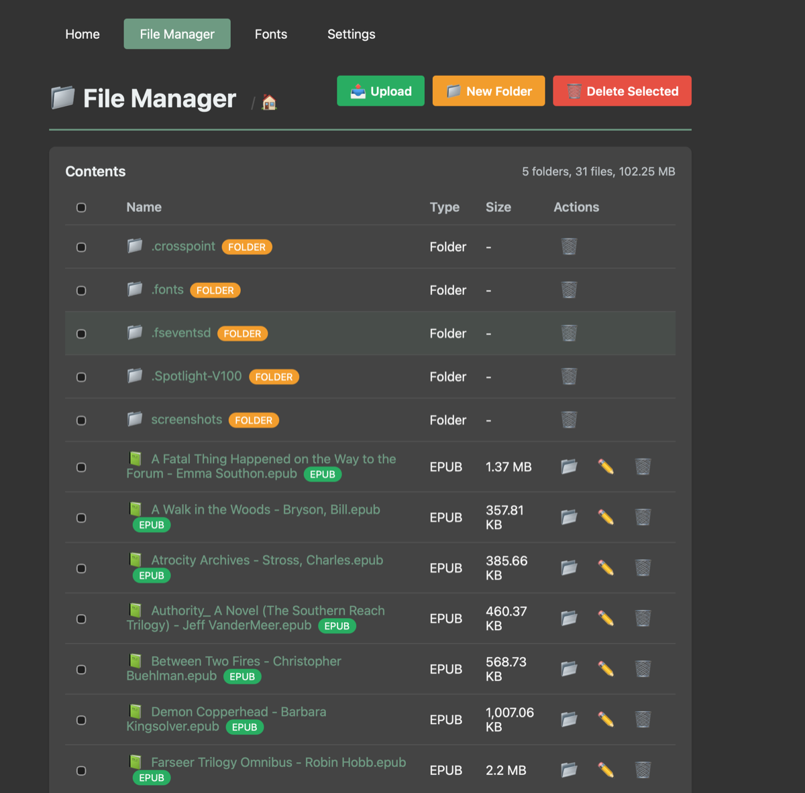
2. **Calibre Wireless** — receive books sent from Calibre's *Send to device*. Install the [crosspoint_reader Calibre plugin](https://github.com/crosspoint-reader/calibre-plugins/releases) (Preferences → Plugins → Load plugin from file), then on the device choose *Calibre Wireless* and join a network. Your computer must be on the same WiFi.
3. **Create Hotspot** — the device becomes its own access point when no shared WiFi is available; join it from your computer, then use the web uploader.
4. **BookFusion Library** — browse and download from your linked [BookFusion](https://www.bookfusion.com/) cloud library (see **[Sync](#10-sync-bookfusion--koreader)** for account linking).

### OPDS Browser

If you run an OPDS catalogue (e.g. Calibre Content Server), set it up in **Settings → System → OPDS Browser** (for Calibre Content Server, append `/opds` to the URL). Only HTTP **Basic** auth is supported — if using Calibre with auth, switch it from Digest to Basic. Once configured, **OPDS Browser** appears on the Home menu.

### Download from URL

**Settings → Developer → Download from URL** (Developer Mode) fetches a file (e.g. a `firmware.bin` or an EPUB) directly to the SD card by URL.

> [!TIP]
> Large, image-heavy EPUBs (10 MB+) can be slow to convert and use a lot of memory. When downloading such a book from BookFusion you'll get a size warning first. For faster covers/thumbnails, pre-optimise EPUBs with a converter such as [epub-to-xtc-converter](https://github.com/bigbag/epub-to-xtc-converter).

---

## 6. Browsing Your Library

### Browse Files

A file/folder browser over the SD card.

- **Navigate:** **Left/Up** and **Right/Down** move the cursor; long-press to jump a full page.
- **Open:** **Confirm** opens a folder or reads a book.
- **Delete:** hold and release **Confirm** to delete the selected file (with a confirm/cancel prompt). Folder deletion is not supported.
- **Progress column:** each row shows a right-aligned marker — `X` (finished, ≥90%), a percentage like `21%` (in progress), or blank (unopened / directory).
- A **`& `** prefix marks books linked to your BookFusion account.

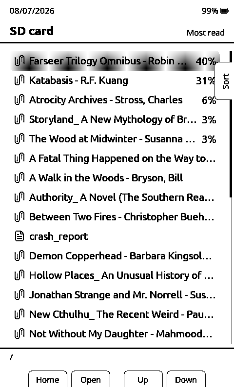

### Folder views

**Settings → Display → Folder View** changes how Browse Files is organised:

| View | Behaviour |
|------|-----------|
| **Folders** (default) | Real SD-card directory structure. |
| **Tags** | Groups books by tag (from BookFusion / metadata). |
| **Authors** | Groups books by author. |
| **Series** | Groups books by series. |

Tags / Authors / Series present a list of groups; open a group to see its books.

### Sorting

Lists (Library, Recent Books, File Browser) are sortable. **Short-press Power** opens the **Sort Menu**; the chosen mode persists across reboots. Modes include: Name A–Z / Z–A, Author A–Z / Z–A, Recently / Least-recently opened, Most / Least read, Newest / Oldest on device, Date added, **BookFusion first / last**, and **Tag A–Z / Z–A**.

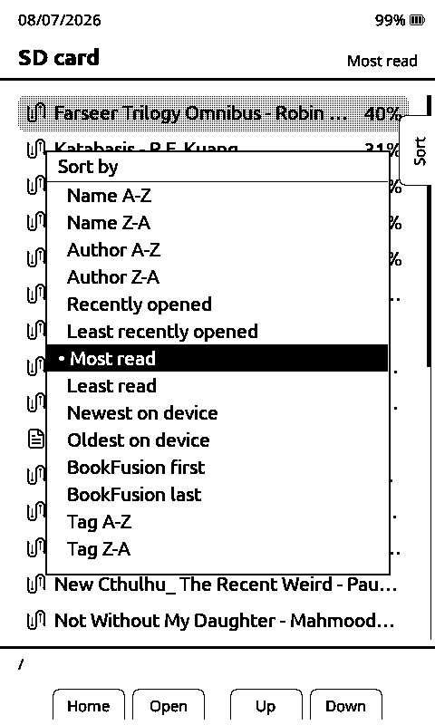

---

## 7. The Reader Menu

Press **Confirm** while reading to open the reader menu.

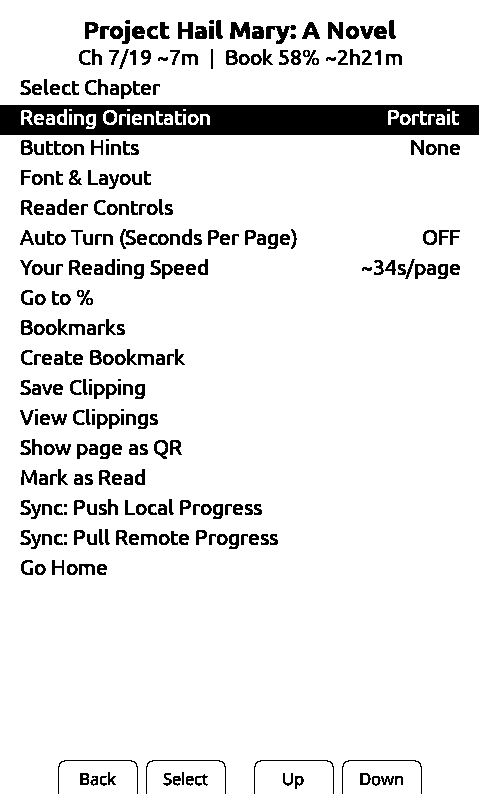

Available actions:

| Action | What it does |
|--------|--------------|
| **Select Chapter** | Table of contents — jump to any chapter. |
| **Footnotes** | *(shown only when the page has footnotes)* View footnotes in a menu. |
| **Go to Percent** | Jump to a position by percentage. |
| **Auto Page Turn** | Set the auto-turn interval (see **[Auto-Turn](#auto-turn)**). |
| **Reading Speed** | View / calibrate your reading speed (drives Auto-Turn and time-left estimates). |
| **Rotate Screen** | Change orientation (Portrait / Landscape CW / Inverted / Landscape CCW). |
| **Button Hints** | Toggle on-screen button-hint mode. |
| **Bluetooth Remote** | *(shown when a remote is paired)* Turn the BLE page turner on/off — see **[Bluetooth Page Turner](#11-bluetooth-page-turner)**. |
| **Font & Layout** | Live font/layout preview editor. |
| **Reader Controls** | Rebind per-button reader actions. |
| **Bookmarks** | View and jump to saved bookmarks. |
| **Add Bookmark** | Bookmark the current page. |
| **Save Clipping** | Save a text clipping/highlight from the current page. |
| **View Clippings** | Browse saved clippings for this book. |
| **Take Screenshot** | Save the current screen to `screenshots/`. |
| **Display QR** | Show a QR code (e.g. to open a link). |
| **Book Info** | Full metadata panel (see below). |
| **Mark as Completed** | Sets progress to 100%, counts the book as finished, returns Home. |
| **Go Home** | Close the book and return to the Home screen. |
| **Sync: Push / Pull** | Upload or apply reading progress with your sync server. |
| **Delete Cache** | Clear this book's cached layout (forces a re-parse). |

### Book Info panel

**Book Info** shows the open book's full metadata: series & number, bookshelf, categories, lists, publisher, published date, tags, rating, language, and the full description (or "No description available"). Series/shelf/tags/rating/description are populated for books synced from BookFusion.

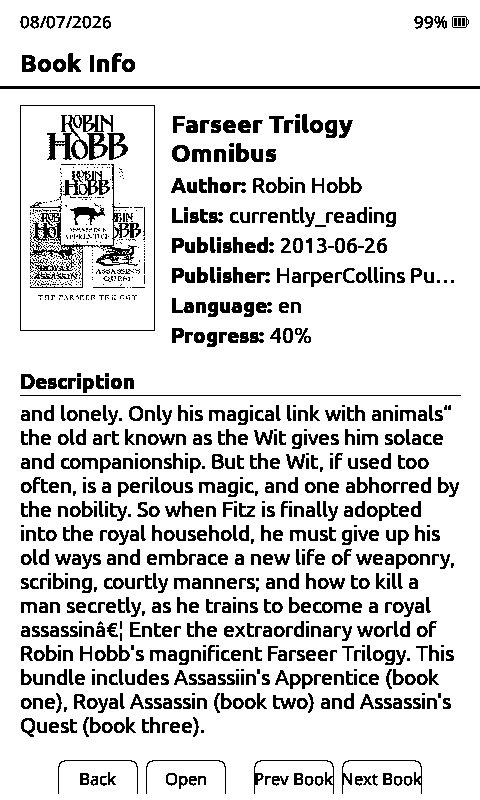

### Footnotes

**Settings → Reader → Footnotes** chooses how footnotes appear:

- **On page** — footnote text is rendered at the bottom of the referencing page, beneath a horizontal rule. Layout reserves space so it never overlaps the body text.
- **In menu** — footnotes are collected into the reader menu instead.

---

## 8. Bookmarks & Clippings

- **Bookmarks** mark a page so you can jump back to it. Add one with the reader menu's **Add Bookmark** (or bind **Bookmark** to a button / long-press / short-Power). View and jump via **Bookmarks**.
- **Clippings** save passages of text from a book. Use **Save Clipping** while reading, then **View Clippings** to review them. Clippings are text-only.

When saving a clipping you pick the start and end lines directly on the page — the selected passage is shown highlighted:


---

## 9. Reading Stats

Open from **Home → Reading Stats**. Tracks sessions across `.epub`, `.txt`, and `.xtc`. Metrics include **Reading Time, Pages Read, Books Finished, Sessions, Average Session, Reading Speed,** and **In Progress**. Books at **≥90%** count as finished.

Stats are organised into tabs — **Overview** (streaks, daily goal, totals, and a reading profile), **Books**, **Week**, **Month** (a calendar heat-map of reading time per day), and **Sessions**:

<p>
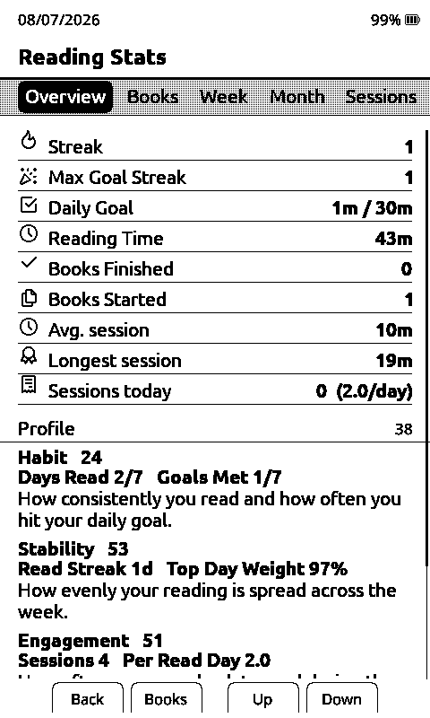
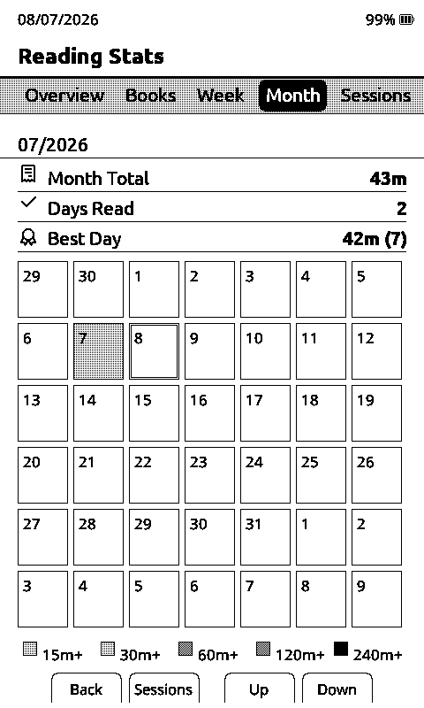
</p>

### Configuring stats (Settings → Stats tab)

- **Daily Reading Goal** — 5 / 10 / 15 / 30 / 60 min.
- **Minimum Session Length** — the shortest activity (1 / 3 / 5 min) that counts as a session.
- **Set Date** / **Time Zone** — keep timestamps and streaks accurate.
- **Export Reading Stats / Import Reading Stats / Export to StoryGraph** — back up or move your stats.
- **"If Found" contact** — a contact string (e.g. a phone number) that can be shown on the sleep screen.

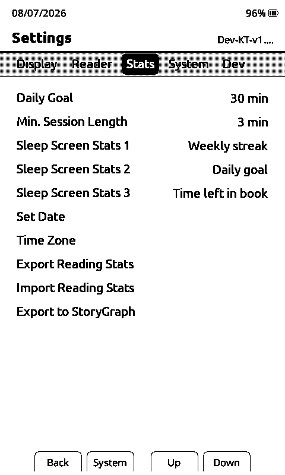

### Sleep-screen stats

You can surface up to **three** reading stats on the sleep screen. **Settings → Stats → Sleep Stat 1 / 2 / 3** each pick one of: Today, Daily Goal, This Week, Streak, This Month, Total, Books Finished, "If Found" contact, Book Progress, Daily Average, Days This Month, Week Streak, Goal Remaining, or Book Time Left (or **None**).

---

## 10. Sync (BookFusion & KOReader)

KatiePoint supports two independent progress-sync systems.

### BookFusion

Links your [BookFusion](https://www.bookfusion.com/) cloud account.

1. **Settings → System → BookFusion Sync** → link your account with the on-screen **device code** (OAuth).
2. Browse your cloud library from **Home → File Transfer → BookFusion Library**, filtered by category (Currently Reading / Favorites / Plan to Read / Completed / All Books) or by your own bookshelves, and **download** EPUBs straight to the SD card. A tick marks books already on the device.

   <p>
   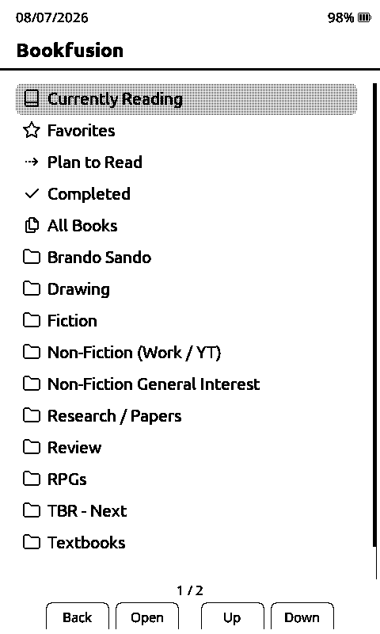
   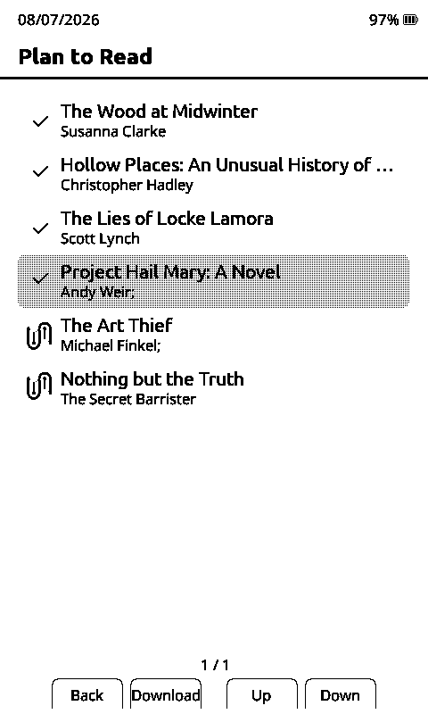
   </p>

   And here's what browsing and downloading from the BookFusion library looks like:

   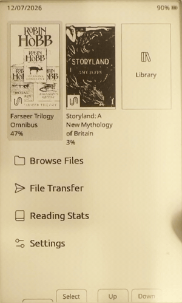

3. **Sync progress & reading time** bidirectionally: **long-press Confirm** while reading (or the reader menu's **Sync** entries).

   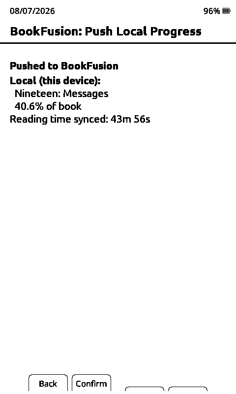

BookFusion also pulls rich metadata (series, bookshelf, tags, rating, lists, description) into the **[Book Info](#book-info-panel)** panel, adds **BookFusion first/last** and **Tag A–Z/Z–A** sort modes, and marks synced books with a **`& `** prefix in all list views. Book covers for BookFusion books always come from the API image (not the EPUB).

### KOReader Sync Quick Setup

KatiePoint syncs reading position with KOReader-compatible sync servers, and interoperates with KOReader apps/devices using the same server and credentials.

#### Option A: Free Public Server (`sync.koreader.rocks`)

1. Register a user once (only if you don't already have KOReader Sync credentials):

```bash
USERNAME="user"
PASSWORD="pass"
PASSWORD_MD5="$(printf '%s' "$PASSWORD" | openssl md5 | awk '{print $2}')"

curl -i "https://sync.koreader.rocks/users/create" \
  -H "Accept: application/vnd.koreader.v1+json" \
  -H "Content-Type: application/json" \
  --data "{\"username\":\"$USERNAME\",\"password\":\"$PASSWORD_MD5\"}"
```

An `HTTP 402` with `{"code":2002,"message":"Username is already registered."}` means the name is taken — pick another or use that account.

2. On each KatiePoint device: **Settings → System → KOReader Sync**.
   - Set **Username** and **Password** (enter the *plain* password; KatiePoint computes MD5 internally). Use the same values on every device.
   - Set **Sync Server URL** to `https://sync.koreader.rocks`, or leave it empty (same default).
   - Run **Authenticate**.

3. While reading, open the reader menu → **Sync**. Choose **Apply Remote** to jump to the remote position, or **Upload Local** to push your current progress.

#### Option B: Self-Hosted Server (Docker Compose)

1. Start a sync server:

```bash
mkdir -p kosync-quickstart && cd kosync-quickstart

cat > compose.yaml <<'YAML'
services:
  kosync:
    image: koreader/kosync:latest
    ports:
      - "7200:7200"
      - "17200:17200"
    volumes:
      - ./data/redis:/var/lib/redis
    environment:
      - ENABLE_USER_REGISTRATION=true
    restart: unless-stopped
YAML

docker compose up -d   # or: podman compose up -d
```

> [!NOTE]
> `ENABLE_USER_REGISTRATION=true` is convenient for first setup. Set it to `false` afterwards to avoid unexpected registrations.

2. Verify: `curl -H "Accept: application/vnd.koreader.v1+json" "http://<server-ip>:17200/healthcheck"` → `{"state":"OK"}`.

3. Register a user (KatiePoint authenticates with the MD5 of the password):

> [!WARNING]
> Sending a reusable MD5-derived password over plain HTTP is insecure. Create unique sync-only credentials — don't reuse your main password. Prefer the HTTPS listener (`https://<server-ip>:7200`) on untrusted networks; use `curl -k` only for self-signed-cert testing.

```bash
USERNAME="user"
PASSWORD="pass"
PASSWORD_MD5="$(printf '%s' "$PASSWORD" | openssl md5 | awk '{print $2}')"

curl -i "http://<server-ip>:17200/users/create" \
  -H "Accept: application/vnd.koreader.v1+json" \
  -H "Content-Type: application/json" \
  --data "{\"username\":\"$USERNAME\",\"password\":\"$PASSWORD_MD5\"}"
```

4. On each device: **Settings → System → KOReader Sync** → set Username/Password (plain password), **Sync Server URL** = `http://<server-ip>:17200` (or `https://<server-ip>:7200`), then **Authenticate**.

5. Sync from the reader menu as in Option A.

**Document Matching** (KOReader Sync settings) chooses how books are matched across devices: **Filename** or **Binary** (content hash).

---

## 11. Bluetooth Page Turner

KatiePoint can pair with cheap BLE page-turner remotes and clickers (Bluetooth HID devices) so you can turn pages without touching the device.

> **Fair warning:** this feature is experimental. Cheap remotes all speak slightly different dialects, and Bluetooth is a serious RAM hog on this hardware — so KatiePoint is deliberately strict about when it runs.

### Every button turns the page forward

KatiePoint does **not** map remote buttons to separate forward/back actions. *Any*
button on the remote turns one page forward.

This is deliberate. Cheap clickers disagree about almost everything — some send a
different code per button, some send the *same* code for every button, and
one-button models alternate between two codes on each press. Trying to tell those
apart was unreliable in practice, so KatiePoint doesn't try. There is no button
mapping step, and nothing to configure.

The trade-off: **you cannot page backwards with the remote.** Use the device's own
buttons for that. Remotes that only send data while a button is held (rather than
on press) are not supported.

### Pairing a remote

1. **Put the remote into pairing mode first.** This is the step most people miss —
   the remote must be actively advertising or it will not appear in the scan. How
   you do it varies by model; commonly it is holding a button for a few seconds
   until an LED flashes. Check your remote's instructions.
2. Go to **Settings → System → Bluetooth Page Turner**.
3. Set **Bluetooth** to On, then choose **No remote - connect one** to scan.
4. Pick your remote from the list (unnamed devices that aren't input devices are
   hidden automatically). Once connected, it's remembered for reconnection.

When it connects, KatiePoint spends about a second watching the remote sit idle so
it can learn what "no button pressed" looks like for that model. Don't hold a
button during those first couple of seconds after connecting.

### Give yourself a way to turn it back on

**Do this while you're setting up, not later.** Bluetooth turns itself off often
(see below), and if you have no quick way to switch it on, using a remote becomes
tedious. Either:

- Keep the **Bluetooth Remote** row visible in the reader menu (**Settings → Reader
  → Bluetooth in Menu**), or
- Bind **Bluetooth Remote** to a button via **Settings → Reader Controls** — this
  is the faster option, and pressing the bound button again turns it off and frees
  the memory.

### Day-to-day use

- If the remote stops responding, **press one of its buttons** — the device listens
  for it waking up and reconnects within a couple of seconds.
- Long-press gestures (such as chapter skip) work from the device's own buttons
  only. A remote press is always a single page turn.

### Why does Bluetooth keep turning itself off?

By design. Bluetooth needs a large slice of the device's very limited RAM, so
KatiePoint shuts it down whenever that memory is needed elsewhere: during
**syncing**, while **indexing chapters**, when you **leave the reader** (home
screen, library, settings), and in **sleep**.

**It never turns itself back on — including after a sync.** This catches people
out: you sync, carry on reading, and the remote is silently dead. Flip the
reader-menu row or press your bound button to bring it back.

That is not laziness on the device's part. Bringing Bluetooth up immediately after
a WiFi session is unreliable on this chip — it has been observed to freeze the
device outright — so re-enabling is always left as a deliberate choice you make
once the radio has settled.

Occasionally the toggle will refuse with a memory message. Bluetooth needs one
large *unbroken* run of free memory, and after heavy activity the free memory can
be plentiful but fragmented into pieces too small to use. Turning a page or two,
or leaving and re-entering the book, usually frees a large enough run; a restart
always will.

---

## 12. Settings Reference

Settings are organised into tabs, selected via the top ribbon: **Display**, **Reader**, **Stats**, **System**, and **Developer** (only when Developer Mode is on). Most of these are also editable from the web settings page (File Transfer → Join Network).

### Display tab

- **Sleep Screen** — Dark / Light / Custom / Cover / None / Cover + Custom (see **[Sleep Screen](#13-sleep-screen)**).
- **Sleep Cover Mode** — Fit / Crop (when using a cover sleep screen).
- **Sleep Cover Filter** — None (grayscale) / Contrast / Inverted.
- **Seamless Sleep Screen** — Never / After Timeout / Always.
- **Hide Battery %** — Never / In Reader / Always (icon still shown).
- **Refresh Frequency** — full-refresh every 1 / 5 / 10 / 15 / 30 pages (reduces ghosting).
- **UI Theme** — Classic / Lyra / Lyra Extended / Lyra Library (see **[Home Screen](#3-home-screen)**).
- **Sunlight Fading Fix** — software fix for white X4 units fading in direct sunlight.
- **Reader Dark Mode** — invert reading to light-on-dark.
- **Folder View** — Folders / Tags / Authors / Series (see **[Folder views](#folder-views)**).

### Reader tab

- **Font Family** — Bookerly / Inter / Open Dyslexic / Monospace. SD-card fonts can also be loaded (see [sd-card-fonts](./docs/sd-card-fonts.md)).
- **Font Size** — Small / Medium / Large / X-Large (plus an X-Small size).
- **Line Spacing** — Tight / Normal / Wide.
- **Screen Margin** — 5–40 px in 5-px steps.
- **Paragraph Alignment** — Justify / Left / Center / Right / Book's Style.
- **Embedded Style** — use the EPUB's own HTML/CSS formatting.
- **Orientation** — Portrait / Landscape CW / Inverted / Landscape CCW.
- **Extra Paragraph Spacing** — space between paragraphs vs. first-line indent.
- **Text Anti-Aliasing** — smooth grey edges on text (slightly slower page turns).
- **Images** — Display / Placeholder / Suppress.
- **Footnotes** — On page / In menu.
- **Bionic Reading** — bold word-starts (see **[Bionic Reading](#bionic-reading)**).
- **Show Button Hints** — None / Short Press / Long Press / Front Only Short / Front Only Long.
- **Font & Layout Preview** *(action)* — live split-screen font/layout editor: the sample page at the top re-renders as you change each option below.

  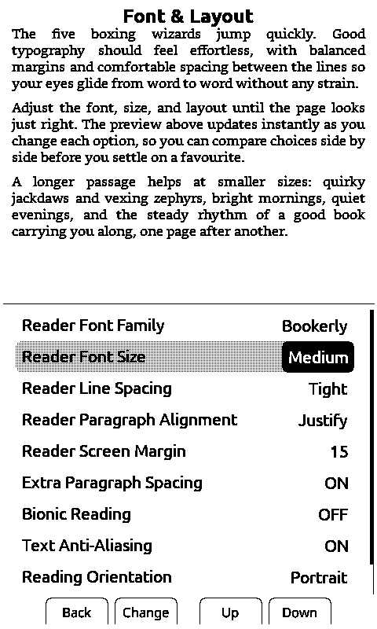

- **Customise Status Bar** *(action)* — see below.
- **Reader Controls** *(action)* — bind a **short-press** and **long-press** action to each reader button. Choose from Chapter Forward/Back, Menu, Files, Sync, Bookmark, Screenshot, Mark Finished, Auto Turn, Bionic, Button Hints, Rotate, and more. Bindings attach to *logical* button roles, so they survive front-button remaps. There's a live preview; **Confirm** cycles, **Back** saves.

  <p>
  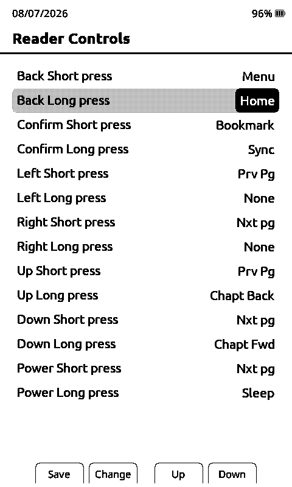
  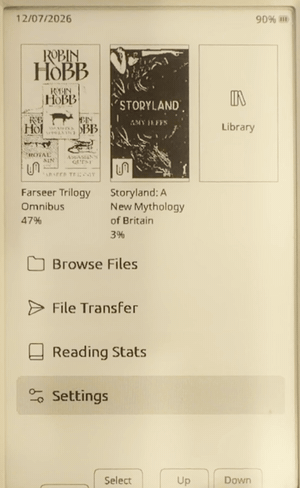
  </p>

#### Customise Status Bar

Configure what the reading status bar shows: **Chapter Page Count**, **Book Progress %**, **Progress Bar** (Book / Chapter / Hide) and its **thickness** (Thin / Medium / Thick), **Title** (Book / Chapter / Hide), **Battery**, **Time Left** (Hide / Chapter / Book), and a **Clock** (with UTC offset and 12h/24h format). These are also editable from the web settings page.

### Stats tab

See **[Reading Stats](#9-reading-stats)** — Daily Reading Goal, Minimum Session Length, Sleep Stat slots 1–3, "If Found" contact, Set Date, Time Zone, and Export/Import (incl. StoryGraph).

### System tab

- **Front Button Follows Orientation** — front-button roles rotate with the screen.
- **Remap Front Buttons** *(action)* — reassign the four front buttons to different physical positions.
- **Short Power Button** — what a short Power press does: Sync / Page Turn / Force Refresh / Sleep / Create Bookmark.
- **Long-press Action** — the reader long-press action (Sync / Page Turn / Force Refresh / Sleep / Create Bookmark).
- **Tilt Page Turn** *(X3 only, when the IMU is present)* — Off / Normal / Inverted.
- **WiFi Networks** *(action)* — manage saved networks.
- **Bluetooth Page Turner** *(action)* — pair a BLE remote (see **[Bluetooth Page Turner](#11-bluetooth-page-turner)**).
- **KOReader Sync** *(action)* — see **[KOReader Sync](#koreader-sync-quick-setup)**.
- **BookFusion Sync** *(action)* — link/manage your BookFusion account.
- **OPDS Browser** *(action)* — server URL, username, password.
- **Check for Updates** *(action)* — OTA firmware update over WiFi.
- **SD Firmware Update** *(action)* — flash a `firmware.bin` from the SD card.
- **Language** *(action)* — set the UI language.
- **Time to Sleep** — auto-sleep after 1 / 5 / 10 / 15 / 30 min of inactivity.
- **Show Hidden Files** — show dotfiles in the browser.
- **Developer Mode** — reveals the Developer tab.

### Developer tab *(Developer Mode only)*

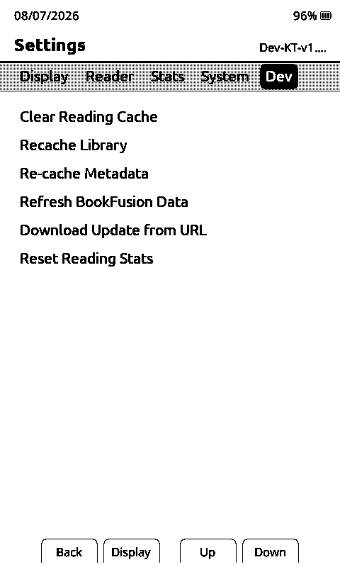

- **Clear Reading Cache** — wipe the `.crosspoint/` cache (forces re-parse of all books).
- **Recache Library** — rebuild the Library cover-grid index.
- **Recache Metadata** — rebuild book metadata.
- **Refresh BookFusion Metadata** — re-pull metadata for linked books.
- **Download from URL** — fetch a file to the SD card by URL.
- **Reset Reading Stats** — clear all statistics.

---

## 13. Sleep Screen

The **Sleep Screen** setting controls what shows when the device sleeps:

| Mode | Behaviour |
|------|-----------|
| **Dark** (default) | KatiePoint logo on a dark background. |
| **Light** | Logo on a white background. |
| **Custom** | A custom image from the SD card (see below); falls back to Dark. |
| **Cover** | Cover of the currently open book; falls back to Dark if no book is open. |
| **Cover + Custom** | Book cover, falling back to Custom behaviour. |
| **None** | Blank screen. |

**Cover settings** (for Cover / Cover + Custom): **Cover Mode** — Fit (scale to fit, white borders) or Crop (scale & fill); **Cover Filter** — None (grayscale), Contrast (B&W), or Inverted.

**Custom images:**

- **Multiple (recommended):** create a `.sleep` directory at the SD-card root and drop in any number of `.bmp` files — one is chosen at random each sleep. (A `sleep` directory is also accepted.)
- **Single:** place `sleep.bmp` at the SD-card root as a fallback.

> [!TIP]
> Use uncompressed 24-bit BMPs. Match your screen: **X4 = 480×800**, **X3 = 528×792**.

You can also overlay up to three reading stats on the sleep screen — see **[Sleep-screen stats](#sleep-screen-stats)**. Here's a Custom (dark) sleep screen with the weekly streak, daily goal, and book-time-left stats shown at the bottom:


---

## 14. Firmware Updates

- **Over the air:** **Settings → System → Check for Updates** pulls the latest release. An SD card must be inserted while it stages the image.
- **From SD card:** put a release `firmware.bin` on the card and use **Settings → System → SD Firmware Update**.
- **From URL:** **Settings → Developer → Download from URL**.

Prebuilt firmware is on the [Releases page](https://github.com/InsiderPhD/crosspoint-reader/releases).

---

## Supported Languages

KatiePoint renders text using these Unicode blocks:

- **Latin (Basic, Supplement, Extended-A):** English, German, French, Spanish, Portuguese, Italian, Dutch, Swedish, Norwegian, Danish, Finnish, Polish, Czech, Hungarian, Romanian, Slovak, Slovenian, Turkish, and others.
- **Cyrillic (Standard and Extended):** Russian, Ukrainian, Belarusian, Bulgarian, Serbian, Macedonian, Kazakh, Kyrgyz, Mongolian, and others.

**Not supported:** Chinese, Japanese, Korean, Vietnamese, Hebrew, Arabic, Greek, Farsi.

The **UI language** (menus and messages) is set in **Settings → System → Language**. Available UI languages include English, Spanish, French, German, Italian, Portuguese, Russian, Ukrainian, Polish, Swedish, and Norwegian.

---

## 16. Troubleshooting & Escaping Bootloop

If you hit a crash, please open an issue and attach serial-monitor logs. Connect the device by USB and run:

```
pio device monitor
```

(or use a browser tool like [Serial Monitor](https://www.serialmonitor.org/)).

**Stuck in a bootloop?** Press and release **Reset**, then hold **Back + Power** to boot to the Home screen (skipping auto-reopen of the last book).

**Corrupt cache or config?** Delete the `.crosspoint` directory on the SD card — or, more surgically, just `settings.bin`, `state.bin`, or an `epub_*` cache folder inside `.crosspoint/`. See also [docs/troubleshooting.md](./docs/troubleshooting.md).
